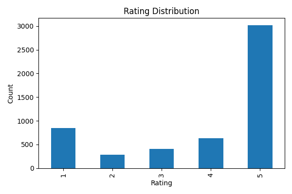
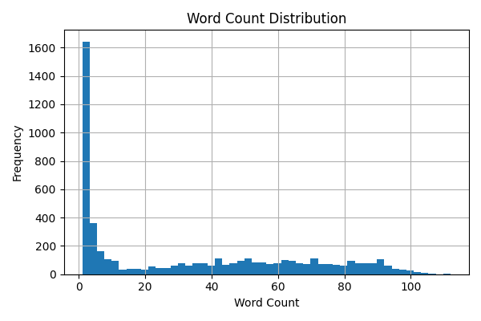
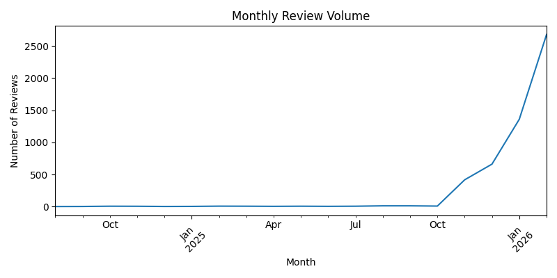

# Google Play Reviews — Descriptive & Statistical Analysis (Round 1 vs Round 2)

**App:** ChatGPT (com.openai.chatgpt)  
**Goal:** Profile the dataset produced by the ingestion pipeline (distributions, summary stats, time patterns, data quality).  
**Sort modes:** newest + most_relevant

---

## 1) Dataset overview

| Metric | Round 1 | Round 2 |
|---|---:|---:|
| Target per sort mode | 400 | 2600 |
| Rows | 800 | 5200 |
| Columns | 13 | 13 |
| Review date range | 2024-08-31 → 2026-01-29 | 2024-08-31 → 2026-02-05 |
| Sort mode breakdown | newest=400, most_relevant=400 | newest=2600, most_relevant=2600 |
| % missing `app_version` | 3.0% | 3.21% |
| Duplicate `review_uid` | 0 | 0 |

**Notes**
- Schema consistency and missingness remained stable at higher scale.

---

## 2) Basic distributions — Ratings

### Rating counts

| Rating | Round 1 count | Round 2 count |
|---:|---:|---:|
| 1 | 154 | 853 |
| 2 | 65 | 287 |
| 3 | 88 | 412 |
| 4 | 99 | 631 |
| 5 | 394 | 3017 |

### Summary statistics
- **Round 1:** mean=**3.64**, median=**4**, std=**1.59**
- **Round 2:** mean=**3.90**, median=**5**, std=**1.53**

### Observations
- As sample size increased, the rating distribution became **more positively skewed** (mean increased from **3.64 → 3.90**, median shifted to **5**).
- A meaningful negative tail persists (Round 2 includes **~16% 1-star** reviews), supporting downstream analysis for negative feedback / issue detection.

## Rating Distribution

---

## 3) Basic distributions — Review length (word count)

### Summary statistics
- **Round 1:** mean=**41.30**, median=**44**, p25=**2**, p75=**78.25**, p95=**94**, max=**110**
- **Round 2:** mean=**33.58**, median=**25**, p25=**2**, p75=**62**, p95=**90.05**, max=**112**

### Short / low-signal reviews
- **% very short (≤3 words):**
  - Round 1: **30.4%**
  - Round 2: **31.6%**
- **% emoji/symbol-only:**
  - Round 1: **1.1%**
  - Round 2: **1.19%**

### Observations
- Review text length appears **bimodal**: a persistent cluster of very short reviews (~31% ≤3 words) plus a long tail of detailed feedback.
- The larger sample (Round 2) lowered the median length (**44 → 25 words**), suggesting Round 1 slightly overrepresented longer reviews.
- Emoji-only reviews are rare (~1%), so pure-symbol noise is minimal.

## Word Length Distribution

---

## 4) Timestamps — simple time-based patterns

- The dataset spans **~17–18 months** (2024-08-31 to 2026-02-05), enabling time-based profiling.
- Next step (lightweight) is to aggregate:
  - **review volume over time** (e.g., by day or month)
  - **average rating over time** (e.g., by month)

**Why this matters**
- Helps identify spikes, shifts, or drift that could inform monitoring logic later (e.g., release-related sentiment changes).

## Review Volume Over Time

---

## 5) Early data quality signals

### Missing fields (top)
- `app_version` missing:
  - Round 1: **3.0%**
  - Round 2: **3.21%**
- All other core fields show **~0% missingness** in both rounds (`review_uid`, `user_name`, `rating`, `review_text`, `review_date`, `thumbs_up`, `sort_mode`, `scrape_time`).

### Duplicates
- Duplicate `review_uid`: **0** in both rounds.

### Skew / concentration checks
- Round 2 shows stronger positive skew in ratings (median moved to 5).
- App versions are concentrated in recent releases in Round 2 (latest version dominates the top-10 list), suggesting version-level analysis may be useful.

---

## 6) Key takeaways & implications (for downstream decisions)

1. **Rating distribution stabilizes at scale**: Round 2 is more positively skewed (mean **3.90**, median **5**) while retaining meaningful negative signal (~16% 1★).
2. **Text length is consistently bimodal**: ~31% very short reviews persist; consider a minimum-length threshold for certain NLP tasks.
3. **Temporal coverage is broad** (~17–18 months), enabling basic trend/drift profiling.
4. **Data quality is strong and stable**: minimal missingness, no duplicates, consistent schema across runs.
5. **Version coverage is high** (~97% non-missing), supporting version-based monitoring (e.g., rating by app_version).

