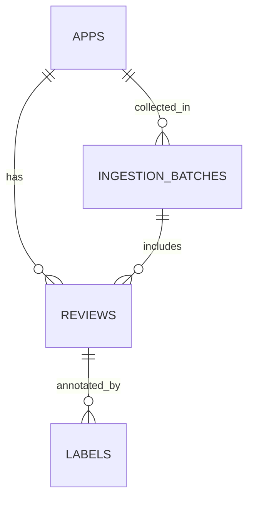

# Database Schema Draft — Google Play Reviews

## 1) Goals
- Represent core entities cleanly (apps, reviews, labels)
- Preserve raw data and ingestion context without premature cleaning
- Support downstream labeling and modeling workflows
- Remain extensible to future apps, sources, and annotations

This schema is informed by exploratory analysis of Google Play review data and reflects observed data availability, quality, and constraints.

---

## 2) Core Entities

### apps
**Purpose:** One row per application being reviewed.

**Fields**
- app_id (PK, TEXT) — stable identifier (e.g., package name) 
- app_name (TEXT)
- platform (TEXT) — e.g., "google_play"
- category (TEXT, nullable)
- created_at (TIMESTAMP)

---

### reviews
**Purpose:** One row per user review; primary unit for analysis, labeling, and modeling.

**Fields**
- review_id (PK, TEXT) — maps to source-provided `review_uid`
- app_id (FK → apps.app_id, TEXT)
- rating (INT) — 1..5
- review_text (TEXT, nullable)
- review_date (TIMESTAMP)
- user_name (TEXT, nullable)
- thumbs_up (INT, nullable)
- app_version (TEXT, nullable)
- sort_mode (TEXT, nullable) — newest / most_relevant / rating (collection context)
- scrape_time (TIMESTAMP)

**Constraints / Indexing**
- CHECK (rating BETWEEN 1 AND 5)
- INDEX (app_id, review_date)
- INDEX (app_id, rating)

---

### labels (extensible)
**Purpose:** Attach one or more labels to a review (human- or model-generated).

**Fields**
- label_id (PK, TEXT)
- review_id (FK → reviews.review_id, TEXT)
- label_type (TEXT) — e.g., "sentiment", "topic", "safety"
- label_value (TEXT)
- label_source (TEXT) — e.g., "human", "heuristic"
- created_at (TIMESTAMP)

**Constraints / Indexing**
- INDEX (review_id)
- UNIQUE (review_id, label_type, label_source, created_at) [optional]

---

## 3) Ingestion Metadata (optional)

### ingestion_batches
**Purpose:** Track how and when reviews were collected to make sampling regimes and potential bias explicit.

**Fields**
- ingestion_id (PK, TEXT)
- source (TEXT) — "google_play"
- app_id (FK → apps.app_id, TEXT)
- sort_mode (TEXT)
- started_at (TIMESTAMP)
- ended_at (TIMESTAMP)
- notes (TEXT, nullable)

**Change to reviews**
- Add reviews.ingestion_id (FK → ingestion_batches.ingestion_id, nullable)

---

## 4) Data Quality Considerations (informed by EDA)
- Missingness: allow nullable fields for metadata that is not consistently available
- Review identity: rely on source-provided `review_uid` as `review_id`; validate stability across sort modes and ingestion batches as data volume grows
- Duplicates: monitor potential duplication across sort modes; deduplication logic can be applied downstream if needed
- Time: normalize timestamps to a consistent format and timezone
- Text: preserve raw `review_text`; filtering or length-based rules should be applied downstream rather than at ingestion

---

## 5) Notes / Open Questions
- **review_id:**  
  The `review_id` field corresponds to the source-provided `review_uid` from Google Play. This identifier is assumed to be stable across sort modes and ingestion batches. this assumption will be validated empirically as ingestion scales.
- **Device type:**  
  The current dataset does not include device-type information and appears to reflect phone-based reviews only. Device-specific attributes can be added in future ingestion iterations if reliably available.
- **Multi-platform support:**  
  If additional platforms (if possible) are added, platform-specific ingestion logic can map into the same core entities while preserving source metadata.
- **Note:**
This schema separates raw review data from labeling and ingestion context to preserve flexibility. Reviews remain the core analytical unit, while labels and ingestion metadata are layered on to support downstream modeling and bias-aware analysis without overwriting raw inputs.

